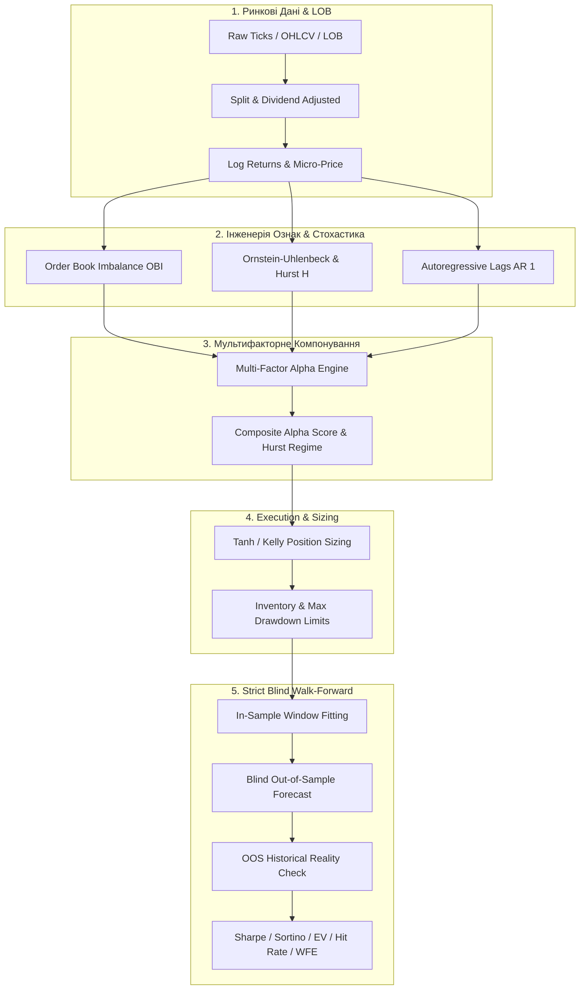

# 🔬 Поглиблене Керівництво з Кількісного Трейдингу та Фінансової Математики
### *Comprehensive Encyclopedia of Quantitative Finance, Market Microstructure & Algorithmic Strategy Design*

---

## Зміст

1. **[Математичні основи та стохастичне моделювання](#1-математичні-основи-та-стохастичне-моделювання)**
   - Геометричний броунівський рух (GBM) та лема Іто
   - Стаціонарність та економетричні тести (ADF, KPSS)
   - Модель Орнштейна-Уленбека (Ornstein-Uhlenbeck) та період напіврозпаду (Half-Life)
   - Показник Херста (Hurst Exponent) та дробовий броунівський рух
   - Коінтеграція та модель корекції помилок (Engle-Granger, Johansen)

2. **[Мікроструктура ринку та механіка Книги Ордерів (LOB)](#2-мікроструктура-ринку-та-механіка-книги-ордерів-lob)**
   - Архітектура Limit Order Book (LOB), рівні глибини та черги
   - Дисбаланс книги ордерів (Order Book Imbalance, OBI)
   - Мікроціна (Micro-Price) та формули Стойкова
   - Декомпозиція спреду та несприятливий відбір (Моделі Глостена-Мілгрома та Кайла)
   - Нелінійний вплив ордерів на ринок (Square-Root Law of Market Impact) та модель Альмгрена-Крісса

3. **[Машинне навчання та інженерія ознак для фінансових рядів](#3-машинне-навчання-та-інженерія-ознак-для-фінансових-рядів)**
   - Логарифмічні дохідності та часова адитивність
   - Авторегресійні моделі (AR, ARMA, GARCH для кластеризації волатильності)
   - Метод потрійного бар'єру (Triple Barrier Method за Лопесом де Прадо)
   - Мета-маркування (Meta-Labeling) для оптимізації розміру позицій
   - Кастомні функції втрат (Differential Sharpe Ratio, асиметричний Loss)

4. **[Математична оптимізація алгоритмів](#4-математична-оптимізація-алгоритмів)**
   - Аналітичний OLS проти регуляризації Ridge ($L_2$), Lasso ($L_1$), ElasticNet
   - Опуклість та оптимізація портфеля Марковіца
   - Градієнтний спуск, Stochastic Gradient Descent (SGD), Adam, AdamW
   - Ландшафти втрат, сідлові точки та локальні мінімуми

5. **[Стратегії виконання: Maker проти Taker](#5-стратегії-виконання-maker-проти-taker)**
   - Модель маркет-мейкінгу Авелланеди-Стойкова (Avellaneda-Stoikov, 2008)
   - Динамічний зсув котирувань (Quote Skewing) та контроль інвентарного ризику
   - Критерій Келлі (Kelly Criterion) та дробовий Келлі (Fractional Kelly)
   - Нелінійні методи сайзингу ($\tanh$, HardTanh, Sigmoid)
   - Масштабування частоти (Frequency Scaling) та мультитейнфреймове комбінування

6. **[Методологія валідації та запобігання перенавчанню (Backtesting Rigor)](#6-методологія-валідації-та-запобігання-перенавчанню-backtesting-rigor)**
   - Пастки бектесту: Lookahead Bias, Survivorship Bias, Data Snooping
   - Walk-Forward Validation (Rolling vs Expanding Window)
   - Purged & Embargoed Cross-Validation (Очищена крос-валідація)
   - Метрики ризику та якості: Sharpe, Sortino, Calmar, Max Drawdown, Profit Factor, Deflated Sharpe Ratio (DSR)

---

# 1. Математичні основи та стохастичне моделювання

## 1.1. Геометричний броунівський рух (Geometric Brownian Motion, GBM)

Стандартна модель динаміки цін активів описується стохастичним диференціальним рівнянням (SDE):

$$\mathrm{d}S_t = \mu S_t \mathrm{d}t + \sigma S_t \mathrm{d}W_t$$

де:
- $S_t$ — ціна активу в момент часу $t$;
- $\mu$ — дрейф (очікувана дохідність / drift);
- $\sigma$ — миттєва волатильність;
- $W_t$ — стандартний вінерівський процес (броунівський рух), для якого $\mathrm{d}W_t \sim \mathcal{N}(0, \mathrm{d}t)$.

Застосовуючи **Лему Іто** до функції $f(S_t) = \ln S_t$:
$$\mathrm{d}(\ln S_t) = \frac{\partial \ln S_t}{\partial S_t}\mathrm{d}S_t + \frac{1}{2}\frac{\partial^2 \ln S_t}{\partial S_t^2}(\mathrm{d}S_t)^2 = \frac{1}{S_t}(\mu S_t \mathrm{d}t + \sigma S_t \mathrm{d}W_t) - \frac{1}{2}\frac{1}{S_t^2}(\sigma^2 S_t^2 \mathrm{d}t)$$

Отримуємо аналітичний розв'язок:
$$S_t = S_0 \exp\left( \left(\mu - \frac{1}{2}\sigma^2\right)t + \sigma W_t \right)$$

Звідси випливає, що логарифмічна дохідність $r_{0 \to t} = \ln(S_t / S_0) \sim \mathcal{N}\left(\left(\mu - \frac{1}{2}\sigma^2\right)t, \sigma^2 t\right)$ є нормально розподіленою.

---

## 1.2. Процес Орнштейна-Уленбека (Ornstein-Uhlenbeck Process) та Mean Reversion

Для активів або спредів, що повертаються до середнього (Mean Reverting), використовується процес Орнштейна-Уленбека:

$$\mathrm{d}X_t = \theta (\mu - X_t)\mathrm{d}t + \sigma \mathrm{d}W_t$$

де:
- $\mu$ — рівень довгострокової рівноваги (довгострокове середнє);
- $\theta > 0$ — швидкість повернення до середнього (Mean Reversion Speed);
- $\sigma$ — волатильність шуму.

### Період напіврозпаду (Half-Life of Mean Reversion):
Дискретна форма авторегресії AR(1) для процесу:
$$\Delta X_t = X_t - X_{t-1} = \alpha + \beta X_{t-1} + \epsilon_t$$

Зв'язок параметрів: $\beta = -(1 - e^{-\theta \Delta t}) \approx -\theta \Delta t$.

**Період напіврозпаду $t_{1/2}$** (час, за який відхилення скорочується вдвічі):
$$t_{1/2} = \frac{\ln(2)}{\theta} = -\frac{\ln(2)}{\ln(1 + \beta)}$$

*Практичне значення:* Якщо $t_{1/2}$ занадто великий (наприклад, 2 роки), капітал заморожується. Якщо занадто малий (секунди), витрати на комісії можуть перевищити прибуток.

---

## 1.3. Показник Херста (Hurst Exponent) та пам'ять ряду

Показник Херста $H \in [0, 1]$ кількісно визначає автокореляційну структуру часового ряду:

1. **$H = 0.5$ — Випадкове блукання (Geometric Random Walk):** відсутність довгострокової пам'яті (гіпотеза ефективного ринку).
2. **$0 \le H < 0.5$ — Антиперсистентний режим (Mean Reversion):** відхилення змінюється поверненням назад ("ефект пружини").
3. **$0.5 < H \le 1.0$ — Персистентний режим (Trending / Momentum):** рух у певному напрямку має властивість продовжуватись.

### Оцінка методом масштабованого розмаху (Rescaled Range Analysis, $R/S$):
$$\mathbb{E}\left[\frac{R(n)}{S(n)}\right] = C \cdot n^H \quad \implies \quad \ln\left(\frac{R(n)}{S(n)}\right) = \ln C + H \ln n$$

де $R(n) = \max_{1 \le k \le n} \sum_{i=1}^k (X_i - \bar{X}) - \min_{1 \le k \le n} \sum_{i=1}^k (X_i - \bar{X})$, а $S(n)$ — стандартне відхилення.

---

## 1.4. Коінтеграція та парний трейдинг (Cointegration & Pairs Trading)

Якщо два цінові ряди $P_t^A$ та $P_t^B$ є нестаціонарними інтегрованими рядами першого порядку $I(1)$, але існує така лінійна комбінація:

$$S_t = P_t^A - \beta P_t^B \sim I(0)$$

яка є **стаціонарною $I(0)$**, то ці ряди називаються **коінтегрованими**, а вектор $[1, -\beta]$ — коінтеграційним вектором.

### Двоетапний метод Енгла-Грейнджера (Engle-Granger Two-Step):
1. Оцінка регресії ціни OLS: $P_t^A = \alpha + \beta P_t^B + \epsilon_t$.
2. Тест залишків $\epsilon_t$ на стаціонарність за допомогою ADF-тесту (Augmented Dickey-Fuller).
3. Якщо $\epsilon_t \sim I(0)$, будується Z-Score спреду:
   $$Z_t = \frac{\epsilon_t - \text{Mean}(\epsilon)}{\text{Std}(\epsilon)}$$
   - Вхід у Long спреду при $Z_t < -2.0$ (купівля $A$, продаж $\beta \cdot B$).
   - Вхід у Short спреду при $Z_t > +2.0$ (продаж $A$, купівля $\beta \cdot B$).
   - Вихід при $Z_t \to 0$.

---

# 2. Мікроструктура ринку та механіка Книги Ордерів (LOB)

## 2.1. Анатомія Limit Order Book (LOB)

Книга ордерів — це неперервний подвійний аукціон, структурований за рівнями цін:
- **Bids:** $\mathcal{B} = \{(P_i^b, V_i^b)\}_{i=1}^K$, де $P_1^b > P_2^b > \dots > P_K^b$ ($P_1^b$ — Best Bid).
- **Asks:** $\mathcal{A} = \{(P_i^a, V_i^a)\}_{i=1}^K$, де $P_1^a < P_2^a < \dots < P_K^a$ ($P_1^a$ — Best Ask).
- **Bid-Ask Spread:** $S = P_1^a - P_1^b$.
- **Mid-Price:** $P_{\text{mid}} = \frac{P_1^a + P_1^b}{2}$.

```
      ASKS (Продавці)
 Рівень 3: $100.03 | Об'єм: 500  ▲
 Рівень 2: $100.02 | Об'єм: 300  │ Walking the Book
 Рівень 1: $100.01 | Об'єм: 150  │ (Slippage)
--------------------------------- ◄ Best Ask = $100.01
   СПРЕД = $0.02  | Mid = $100.00
--------------------------------- ◄ Best Bid = $99.99
 Рівень 1: $99.99  | Об'єм: 200  │
 Рівень 2: $99.98  | Об'єм: 450  │
 Рівень 3: $99.97  | Об'єм: 600  ▼
      BIDS (Покупці)
```

---

## 2.2. Дисбаланс книги ордерів (Order Book Imbalance, OBI)

Найпотужніший короткостроковий предиктор руху $P_{\text{mid}}$ на горизонтах від мілісекунд до хвилин:

$$\text{OBI}_1 = \frac{V_1^b - V_1^a}{V_1^b + V_1^a} \in [-1, 1]$$

Багаторівневий зважений дисбаланс глибини на $K$ рівнях з експоненційним або лінійним згасанням $w_i$:

$$\text{OBI}_K = \frac{\sum_{i=1}^K w_i (V_i^b - V_i^a)}{\sum_{i=1}^K w_i (V_i^b + V_i^a)}, \quad w_i = \frac{1}{i} \text{ або } e^{-\lambda (i-1)}$$

- $\text{OBI} > 0.6 \implies$ переважання покупців $\implies$ очікується ріст $P_{\text{mid}}$.
- $\text{OBI} < -0.6 \implies$ переважання продавців $\implies$ очікується падіння $P_{\text{mid}}$.

---

## 2.3. Мікроціна (Micro-Price) за Сашею Стойковим (Stoikov Micro-Price)

Замість простого середнього $P_{\text{mid}}$, мікроціна враховує тиск ліквідності на першому рівні:

$$P_{\text{micro}} = \frac{V_1^b \cdot P_1^a + V_1^a \cdot P_1^b}{V_1^b + V_1^a} = P_{\text{mid}} + \frac{S}{2} \left( \frac{V_1^b - V_1^a}{V_1^b + V_1^a} \right) = P_{\text{mid}} + \frac{S}{2} \cdot \text{OBI}_1$$

- Якщо $V_1^b \gg V_1^a$ (купувати хочуть набагато більше), $P_{\text{micro}} \to P_1^a$ (ціна тяжіє до виконання верхнього рівня Ask).

---

## 2.4. Вплив ордерів на ринок (Market Impact) та Закон квадратного кореня

При виконанні великого об'єму $Q$ на ринку з денним об'ємом $V$ та волатильністю $\sigma$:

### Закон квадратного кореня (Square-Root Law):
$$I(Q) = Y \cdot \sigma \cdot \sqrt{\frac{Q}{V}}$$

де $Y \approx 0.5\dots0.7$ — безрозмірний універсальний коефіцієнт.

### Модель Альмгрена-Крісса (Almgren-Chriss Optimal Execution):
Оптимальна траєкторія ліквідації позиції $X$ за час $T$ мінімізує очікувані витрати на імпакт плюс штраф за ризик утримання інвентаря:

$$\min_{\{x_t\}} \mathbb{E}[x^T \Gamma x] + \lambda \mathbb{V}\mathrm{ar}[x^T S_T]$$

Розв'язок дає гіперболічну форму траєкторії execution (TWAP/VWAP/Almgren-Chriss).

---

# 3. Машинне навчання та інженерія ознак для фінансових рядів

## 3.1. Метод потрійного бар'єру (Triple Barrier Method за Маркосом Лопесом де Прадо)

Класичне фіксоване прогнозування $r_{t+h}$ має фундаментальну ваду — воно не враховує динаміку всередині інтервалу (можливе спрацювання Stop-Loss або Take-Profit).

Потрійний бар'єр встановлює три межі навколо точки входу $P_0$:
1. **Верхній бар'єр (Take Profit):** $P_{\text{upper}} = P_0 (1 + c \cdot \sigma_t)$
2. **Нижній бар'єр (Stop Loss):** $P_{\text{lower}} = P_0 (1 - c \cdot \sigma_t)$
3. **Вертикальний часовий бар'єр (Time Expiry):** $t + \Delta t_{\max}$

```
  Ціна
   ▲
   │        ┌───────────────────────── Take Profit (+1)
   │       /  \    /
   │  ────/────\──/───────────────────
   │     /      \/ 
   │    P0  ▲
   │        │
   │        └───────────────────────── Stop Loss (-1)
   │
   └────────┬─────────────────────────► Час
            t                         t + Δt (Time Barrier: 0)
```

**Мітки класів (Labels):**
- $+1$: ціна першою торкнулась верхнього бар'єру.
- $-1$: ціна першою торкнулась нижнього бар'єру.
- $0$: жоден бар'єр не досягнуто до вичерпання часу.

---

## 3.2. Мета-маркування (Meta-Labeling)

Двоетапна квант-архітектура:
1. **Первинна модель (Primary Model / Signal Generator):** проста математична або фундаментальна модель генерує напрямок $d \in \{-1, +1\}$.
2. **Вторинна ML-модель (Meta-Model):** прогнозує ймовірність $p = P(\text{Primary Model is Correct})$.
   - Якщо $p > 0.5 \implies$ розмір ставки $S \propto (2p - 1)$ (збільшення розміру позиції при високій впевненості).
   - Якщо $p \le 0.5 \implies$ фільтрація сигналу (розмір $S = 0$).

---

## 3.3. Диференційовний коефіцієнт Шарпа (Differential Sharpe Ratio)

Замість мінімізації MSE (яка не враховує кореляцію та ризик), Муді та Саффелл (Moody & Saffell, 2001) запропонували пряму оптимізацію Sharpe Ratio через градієнтний підйом:

$$D_t = \frac{\mathrm{d}S_t}{\mathrm{d}t} = \frac{B_{t-1} \Delta A_t - \frac{1}{2} A_{t-1} \Delta B_t}{(B_{t-1} - A_{t-1}^2)^{3/2}}$$

де $A_t, B_t$ — експоненційні ковзні моменти першого та другого порядку дохідності $R_t$:
$$A_t = A_{t-1} + \eta (R_t - A_{t-1}), \quad B_t = B_{t-1} + \eta (R_t^2 - B_{t-1})$$

Це дозволяє навчати нейромережі генерувати торгові сигнали, які максимізують прибутковість з урахуванням волатильності напряму.

---

# 4. Математична оптимізація алгоритмів

## 4.1. Регуляризація для фінансових даних

Фінансові часові ряди містять величезну частку шуму (низький Signal-to-Noise Ratio). Звичайний OLS перенавчається.

$$\min_{\mathbf{w}} \frac{1}{2N} \|\mathbf{y} - \mathbf{X}\mathbf{w}\|_2^2 + \lambda_1 \|\mathbf{w}\|_1 + \frac{\lambda_2}{2} \|\mathbf{w}\|_2^2$$

- **Ridge Regression ($\lambda_1 = 0, \lambda_2 > 0$):** $\mathbf{w}_{\text{Ridge}} = (\mathbf{X}^T \mathbf{X} + \lambda_2 \mathbf{I})^{-1} \mathbf{X}^T \mathbf{y}$. Стабілізує інверсію матриці при мультиколінеарності ознак.
- **Lasso Regression ($\lambda_1 > 0, \lambda_2 = 0$):** зануляє неінформативні ознаки (Feature Selection).
- **ElasticNet ($\lambda_1 > 0, \lambda_2 > 0$):** поєднує вибір ознак та групування корельованих предикторів.

---

## 4.2. Сучасні оптимізатори (SGD, AdamW)

| Оптимізатор | Формула оновлення ваг | Особливості у квант-моделях |
|---|---|---|
| **SGD + Momentum** | $v_t = \gamma v_{t-1} + \eta \nabla L$, $w_t = w_{t-1} - v_t$ | Згладжує рух у вузьких ярах функції втрат |
| **Adam** | $m_t = \beta_1 m_{t-1} + (1-\beta_1)g_t$, $v_t = \beta_2 v_{t-1} + (1-\beta_2)g_t^2$ | Адаптивний крок для кожного параметра |
| **AdamW** | $w_t = w_{t-1} - \eta \left( \frac{\hat{m}_t}{\sqrt{\hat{v}_t} + \epsilon} + \lambda w_{t-1} \right)$ | Коректний Weight Decay (ізольований від градієнта), краща генералізація |

---

# 5. Стратегії виконання: Maker проти Taker

## 5.1. Модель маркет-мейкінгу Авелланеди-Стойкова (Avellaneda-Stoikov Model, 2008)

Фундаментальна модель для HFT маркет-мейкінгу. Нехай поточний інвентар трейдера дорівнює $q$, волатильність активу $\sigma$, параметр неприйняття ризику $\gamma$, а горизонт сесії $T$.

### 1. Резервна ціна (Indifference Price / Reservation Price $r$):
$$r(s, q, t) = s - q \cdot \gamma \cdot \sigma^2 \cdot (T - t)$$
- Якщо накопичено довгу позицію ($q > 0$), резервна ціна $r < s$ (нижча за mid-price) $\implies$ маркет-мейкер прагне швидше позбутись інвентаря, виставляючи агресивніший Ask.
- Якщо $q < 0 \implies r > s \implies$ зміщення котирувань вгору для залучення покупців.

### 2. Оптимальний спред відносно резервної ціни:
$$\delta_a^* + \delta_b^* = \gamma \sigma^2 (T - t) + \frac{2}{\gamma} \ln\left(1 + \frac{\gamma}{\kappa}\right)$$

де $\kappa$ — параметр інтенсивності приходу ордерів за формулою $\lambda(\delta) = A e^{-\kappa \delta}$.

### 3. Оптимальні лімітні ціни:
$$P_{\text{bid}}^* = r(s, q, t) - \delta_b^*, \quad P_{\text{ask}}^* = r(s, q, t) + \delta_a^*$$

```
                         Mid-Price (s)
                              │
  [Без позиції: q=0]  ───Bid──┼───Ask───  (Симетрично)
                              │
  [Лонг інвентар: q>0]  ─Bid──┼──────Ask─  (Зсув вниз: скидання лонга)
                              │
  [Шорт інвентар: q<0] ─Bid──────┼──Ask──  (Зсув вгору: закриття шорта)
```

---

## 5.2. Критерій Келлі (Kelly Criterion) та дробовий Келлі

Формула максимізації логарифма капіталу $\mathbb{E}[\ln(W_T)]$:

$$f^* = \frac{p \cdot b - q}{b} = \frac{p(b + 1) - 1}{b} = \frac{\mathbb{E}[R]}{\sigma^2}$$

де $p$ — ймовірність виграшу, $b$ — коефіцієнт виплати (Win/Loss payoff), $q = 1 - p$.

### Чому повний Келлі (Full Kelly) небезпечний:
- Повний Келлі вимагає точного знання $p$ та $b$. У реальному трейдингу параметри нестаціонарні та оцінюються з похибкою.
- Повний Келлі має ймовірність $1/3$ отримати просідання капіталу в **50%**.
- **Стандарт індустрії — Fractional Kelly ($f^* / 2$ або $f^* / 4$):**
  - Забезпечує 75% швидкості росту повного Келлі, але скорочує дисперсію та просідання на **50%–75%**.

---

## 5.3. Нелінійні методи розрахунку розміру позицій

| Метод | Формула | Графік / Поведінка |
|---|---|---|
| **Constant** | $S = \text{sign}(\hat{y}) \cdot S_0$ | Сходинка: фіксований розмір незалежно від сили сигналу |
| **HardTanh** | $S = S_{\max} \cdot \max\left(-1, \min\left(1, \frac{\hat{y}}{\theta}\right)\right)$ | Лінійне зростання до порогу $\theta$, далі жорстке насичення |
| **Tanh (Гладкий)** | $S = S_{\max} \cdot \tanh(k \cdot \hat{y})$ | Гладка $S$-подібна крива, диференційовна всюди |
| **Sigmoidal Prob** | $S = S_{\max} \cdot (2 \cdot \sigma(k \cdot \hat{y}) - 1)$ | Ідеально для класифікаційних моделей з ймовірностями |

---

# 6. Методологія валідації та запобігання перенавчанню (Backtesting Rigor)

## 6.1. Сім смертних гріхів бектестингу (Sins of Financial Backtesting)

1. **Lookahead Bias (Витік майбутнього):** використання даних, які не були доступні в момент $t$ (наприклад, глобальне обчислення $\mu, \sigma$ на всій вибірці).
2. **Survivorship Bias (Помилка того, хто вижив):** тестування лише на компаніях, які існують сьогодні (виключення збанкрутілих акцій завищує Sharpe на 20–40%).
3. **Data Snooping / Multiple Testing:** перебір 10 000 варіацій параметрів, поки випадковий шум не дасть гарний бектест.
4. **Ігнорування витрат виконання:** нульова вартість спреду, проковзування та комісій перетворює збиткову стратегію на "грааль".
5. **Невідкориговані спліти/дивіденди:** створення фіктивних арбітражів або обвалів.
6. **Реінвестування на накладених інтервалах:** фіктивне мультиплікування капіталу.
7. **Overfitting на мікроструктурі:** припущення, що лімітний ордер завжди виконується при першому дотику ціни.

---

## 6.2. Очищена крос-валідація (Purged & Embargoed Cross-Validation)

Стандартний K-Fold CV категорично непридатний для фінансових часових рядів через автокореляцію та витік інформації між train та test блоками.

```
Часова лінія ────────────────────────────────────────────────────────►
 Блок Train 1           │ Purge │    Блок Test    │ Embargo │  Блок Train 2
 [▓▓▓▓▓▓▓▓▓▓▓▓▓▓▓▓▓▓▓▓▓]│ ░░░░░ │ [█████████████] │ ░░░░░░░ │ [▓▓▓▓▓▓▓▓▓▓▓▓▓▓▓▓▓]
```

1. **Purging (Очищення перед Test):** видалення з тренувального набору спостережень, чиї мітки перекриваються за часом з тестовим набором.
2. **Embargoing (Ембарго після Test):** створення буферної зони після тестового набору через автокореляцію залишків та волатильності.

---

## 6.3. Ключові метрики кількісної оцінки

### 1. Sortino Ratio (Коефіцієнт Сортіно):
На відміну від Шарпа, штрафує лише за **негативну волатильність (Downside Risk)**:
$$\text{Sortino} = \frac{E[R] - R_f}{\sigma_{\text{downside}}}, \quad \sigma_{\text{downside}} = \sqrt{\frac{1}{N}\sum_{t=1}^N \min(0, R_t - R_f)^2}$$

### 2. Calmar Ratio (Коефіцієнт Кальмара):
$$\text{Calmar} = \frac{\text{CAGR}}{|\text{Max Drawdown}|}$$

### 3. Deflated Sharpe Ratio (DSR за Лопесом де Прадо):
Коригує коефіцієнт Шарпа з урахуванням кількості протестованих гіпотез $K$ та довжини вибірки $N$:
$$\text{DSR} = \text{Prob}\left(\text{SR} > 0 \mid K \text{ trials, non-normal returns}\right)$$

---

# 7. Багатопараметричні Моделі та Компонування Альфа-Факторів (Multi-Factor Modeling)

## 7.1. Чому одноваріантні правила неефективні
Поодинокі фактори (наприклад, тільки Z-Score або тільки RSI) страждають від **деградації альфи (Alpha Decay)** та залежності від ринкового режиму:
- У трендовому режимі ($H > 0.52$) фактори Mean Reversion генерують безперервні збитки.
- У флетовому режимі ($H < 0.48$) імпульсні фактори генерують хибні пробої (Whipsaws).

## 7.2. Архітектура Композитного Альфа-Скорингу (Composite Alpha Score)
Для стабільного математичного очікування квант-моделі комбінують ортогональні статистичні фактори:

$$\text{Composite Score } S_t = \sum_{k=1}^K w_k(t) \cdot F_k(t)$$

де:
1. **Фактор Mean Reversion ($F_{\text{MR}}$):** $F_{\text{MR}} = -\text{clip}\left(\frac{Z_t}{2.5}, -1, 1\right)$ (оцінка відхилення від середнього).
2. **Фактор Momentum ($F_{\text{MOM}}$):** $F_{\text{MOM}} = \text{clip}\left(\frac{\text{Slope}}{0.3}, -1, 1\right) \times (0.3 + 0.7 R^2)$ (сила та чистота тренду).
3. **Фактор Авторегресії ($F_{\text{AR1}}$):** $F_{\text{AR1}} = \text{clip}\left(\frac{w_{\text{AR1}}}{0.5}, -1, 1\right)$ (напрямок та інерція серійних кореляцій).
4. **Фактор Прискорення ($F_{\text{CURV}}$):** $F_{\text{CURV}} = \text{clip}(500 \cdot \text{Curvature}, -1, 1)$ (2-га похідна цінової траєкторії).

### Динамічна адаптація ваг за режимом ринку (Hurst Regime Adaptation):
$$w_{\text{MOM}}^* = w_{\text{MOM}} \cdot [1 + 2(H - 0.5)], \quad w_{\text{MR}}^* = w_{\text{MR}} \cdot [1 - 1.5(H - 0.5)]$$

---

# 8. Методологія Сліпого Walk-Forward Бектестингу (Strict Blind Out-of-Sample)

```
Часова вісь ────────────────────────────────────────────────────────────────────────────────────────►
 [Крок 1]   │─── T_train (In-Sample) ───│ ──► [ СЛІПИЙ ПРОГНОЗ ŷ ] ──► │─── T_predict (Out-of-Sample) ───│
            (Навчання моделі без майбутнього)                            (Порівняння з реальною історією)

 [Крок 2]         │─── T_train (In-Sample) ───│ ──► [ СЛІПИЙ ПРОГНОЗ ŷ ] ──► │─── T_predict (Out-of-Sample) ───│
                  (Зсув вікна на Step свічок)

 [LIVE ЗАРАЗ]                                                │─── T_train (Останні дані) ───│ ──► 🔮 ПРОГНОЗ НА МАЙБУТНЄ
```

### Етапи процесу:
1. **In-Sample калібрування ($T_{\text{train}}$):** модель розраховує всі квантові метрики виключно на історичному вікні минулого.
2. **Сліпе формування сигналу:** фіксація прогнозного напрямку $\hat{y} \in \{-1, +1, 0\}$, очікуваної дохідності $\hat{R}_{\text{exp}}$, цільової ціни $P_{\text{target}}$ та сайзингу $S = \tanh(2 \cdot \text{Score})$.
3. **Out-of-Sample верифікація ($T_{\text{predict}}$):** "відкриття майбутнього", обчислення реальної дохідності $R_{\text{actual}}$ та фіксація статусу (ВІРНО / ПОМИЛКА).
4. **Walk-Forward Efficiency (WFE):** співвідношення між якістю на тестових даних та стабільністю тренування.

---

# 9. Комплексна структурна схема Quant Engine



